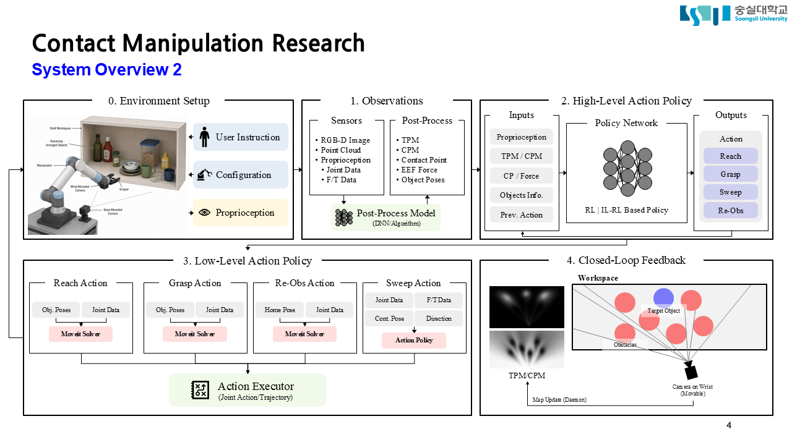
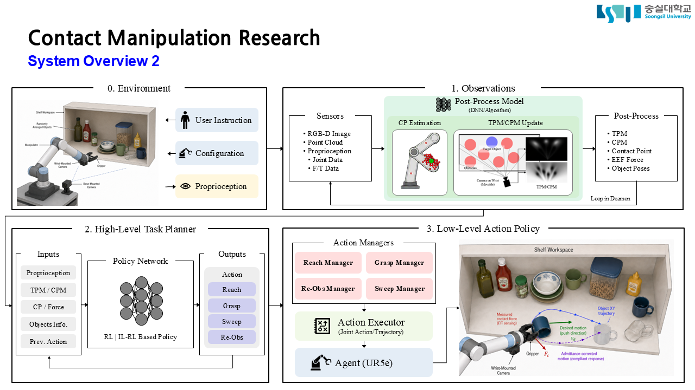
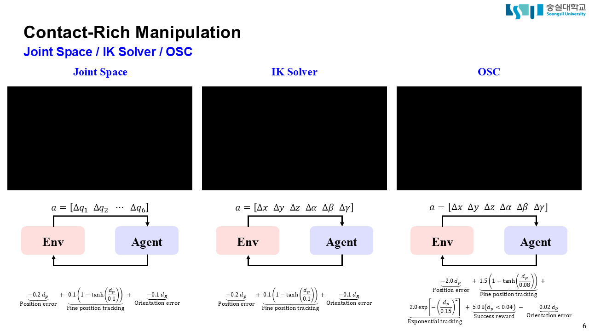
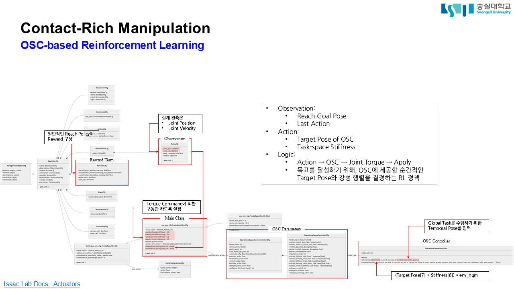
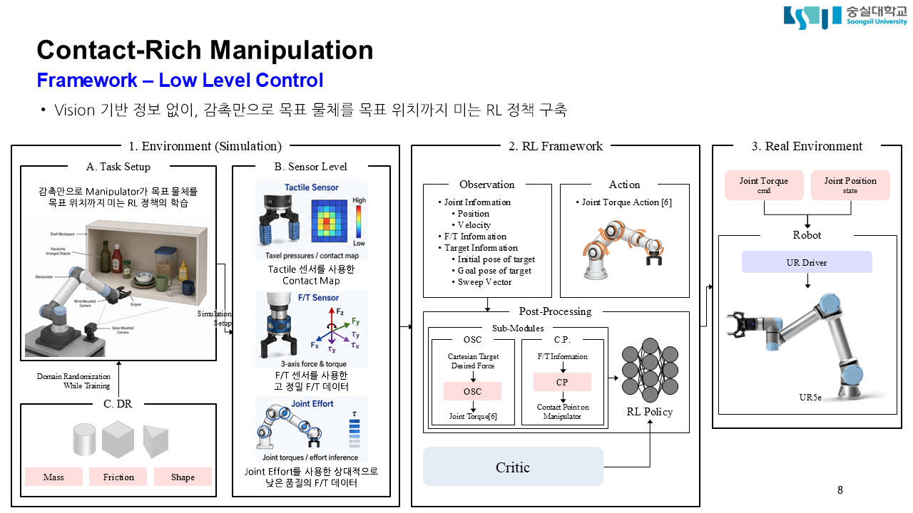
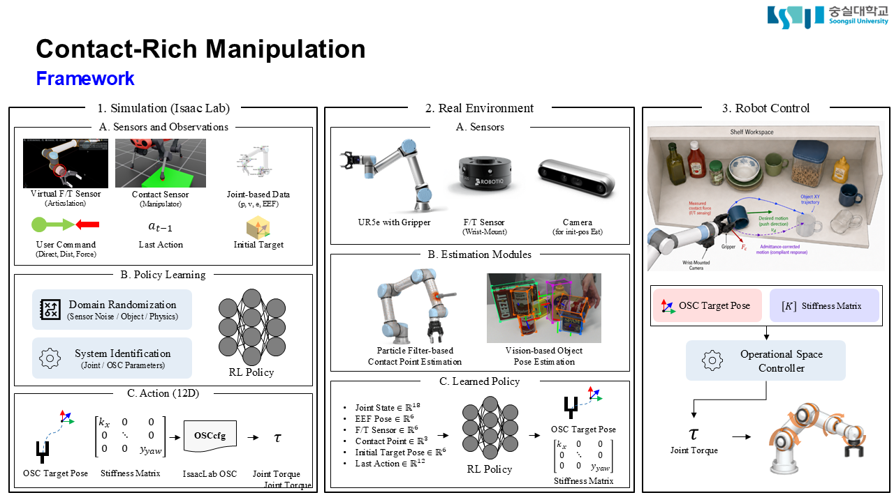

# Vision–Tactile Sweep RL

제한된 시각 및 촉각 관측을 활용해 목표 물체를 탐색하는 로봇 조작 프레임워크입니다. 상위 정책이 수행할 의미 단위 행동을 선택하고, 하위 정책이 이를 실제 로봇 명령으로 변환합니다.

- **High-Level Action Policy**: 공간 및 센서 정보를 바탕으로 목표 물체 탐색 계획 수립
- **Low-Level Action Policy**: 상위 정책이 선택한 Semantic Action을 로봇 동작으로 수행

현재 구현은 Isaac Lab과 RSL-RL을 기반으로 UR5e의 OSC(Operational Space Control) Sweep 정책을 학습하고 검증하는 데 초점을 둡니다. 자세한 실행 방법은 [`src/sweep_rl/README.md`](src/sweep_rl/README.md), 전체 저장소 구성은 [프로젝트 디렉터리 구조](docs/file_directory.md)를 참고하세요.

---

## 설계 발전 과정

아래 세 설계안은 프로젝트의 발전 과정을 나타냅니다. **3차 설계안**이 현재 구현의 기준이며, 앞선 설계안은 상위·하위 정책의 전체 구상을 설명하기 위해 보존합니다.

## 1차 설계안: 계층형 정책

| 레벨 | 이름 | 역할 |
| --- | --- | --- |
| Level 1 | Observation Level | 센서 데이터를 후처리하여 정책이 사용할 관측 정보로 변환 |
| Level 2 | High-Level Action Policy | TPM/CPM 및 센서 정보를 바탕으로 호출할 Action 결정 |
| Level 3 | Low-Level Action Policy | 상위 정책이 선택한 Action을 실제 로봇 명령으로 변환하여 수행 |




### Level 1: Observation Level

Raw Sensor Data를 상위 및 하위 정책이 사용할 수 있는 상태 표현으로 변환합니다.

- RGB-D Image (Base- and Wrist-Mounted)
- Joint Data (Position / Velocity / Effort)
- F/T Sensor

#### Level 1-1: Post-Processed Data

> Level 1의 데이터를 가공하여 얻는 관측 데이터입니다.

- Probability Map
- Contact Point & Wrench

### Level 2: High-Level Action Policy

관측 정보를 바탕으로 목표 물체를 찾기 위해 호출할 Action을 결정합니다(MCP-like).

- `grasp/remove`
- `continuous sweep`
- `re-observe`
- `retrieve target`

### Level 3: Low-Level Action Policy

High-Level Policy가 선택한 Action을 실제 로봇에서 수행 가능한 Motion으로 변환합니다.

#### 입력

- High-Level Action Type
- High-Level Action Parameter
- Current Robot State
- F/T Sensor

#### 출력 예시

- Joint Trajectory
- Joint Velocity Command
- Cartesian Velocity Command
- Gripper Command
- Force-Limited Motion Command
- Emergency Stop / Abort Signal

### 전체 흐름

```text
Observation Level
    └─ Map, Robot State, Sensor Summary 생성
            ↓
High-Level Action Policy
    └─ 호출할 Action 결정
            ↓
Low-Level Action Policy / Action Model
    └─ 선택된 Action을 실제 Robot Command로 변환
            ↓
Robot Execution
            ↓
Sensor Feedback
            ↓
Observation Level에서 Map 갱신
```

---

## 2차 설계안: Sweep RL 타당성 검증

### OSC 테스트




OSC를 사용한 Cartesian Space 정책 학습 테스트입니다. 간단한 Reach 예제로 제어 방식을 검증합니다.

#### 제어 공간 및 차원

|  | Joint Space | IK Solver | OSC |
| :---: | :---: | :---: | :---: |
| **제어 차원** | **N차원** | **6차원** | **12차원** |
| **구성** | Joint Space<br>(Delta) | Cartesian Space<br>(XYZRPY, Delta) | Cartesian Space (XYZRPY, 6차원)<br>+ Stiffness (6차원) |

### Sweep RL Policy Framework

목표 물체의 초기 Pose라는 제한된 시각 정보와 촉각 정보를 사용하는 Sweep RL Policy Framework입니다.



### Domain Randomization

다양한 물체로의 Zero-Shot 전이와 강건한 정책 학습을 위해 Domain Randomization을 적용합니다.

- 물체의 질량
- 물체와 바닥면의 마찰
- 물체의 형태

### 촉각 데이터

다음 세 가지 방법을 고려합니다. 각 방법은 중복하여 사용할 수 있습니다.

#### 1. Tactile Sensor

- **획득 정보**: 그리퍼 옆면 또는 전용 도구에 그리드형 Tactile Sensor를 부착해 Grid 기반 Contact Map 획득
- **장점**: 세 가지 방법 중 가장 높은 품질의 데이터 획득 가능
- **한계**: 실제 하드웨어에서 동일한 관측을 재현하기 어려울 수 있음

참고: [Robotiq Tactile Sensor Fingertips](https://robotiq.com/hs-fs/hubfs/Tactile_sensors_3d_render.png?width=2000&height=1125&name=Tactile_sensors_3d_render.png)

#### 2. F/T Sensor

- **획득 정보**: Wrist 3와 Gripper 사이에 고성능 F/T Sensor를 부착해 등가 힘과 모멘트 획득
- **장점**: UR5e 내장 F/T Sensor 또는 각 Joint Effort 기반 추정보다 정확한 데이터 획득 가능
- **한계**: 낮은 데이터 차원

참고: [Robotiq F/T Sensor](https://robotiq.com/products/ft-300-force-torque-sensor)

#### 3. Joint Effort

- **획득 정보**: 매니퓰레이터에 내장된 Joint Effort를 기반으로 접촉 정보 추정
- **장점**: 별도의 센서가 필요하지 않음
- **한계**: 낮은 해상도
- **검토 사항**: Universal Robots에서 최소한의 정확도를 확보할 수 있는지 확인 필요

#### 관련 연구

- Oh, S., Liu, J. J., Tao, T., Han, P., Shaw, K., Funabashi, S., ... & Pathak, D. (2026). FACTR 2: Learning External Force Sensing for Commodity Robot Arms Improves Policy Learning. *arXiv preprint arXiv:2606.12406*.
- Ma, C., Yao, Y., Wei, Z., Li, R., Szafir, D., & Ding, M. (2026). Current as Touch: Proprioceptive Contact Feedback for Compliant Dexterous Manipulation. *arXiv preprint arXiv:2607.03529*.
- Ge, H., Jia, Y., Li, Z., Li, Y., Chen, Z., Shi, L., ... & Zhou, G. (2025). FILIC: Dual-loop force-guided imitation learning with impedance torque control for contact-rich manipulation tasks. *arXiv preprint arXiv:2509.17053*.

### 후처리 데이터

- **시뮬레이션**: Isaac Lab 환경에서는 [Contact Sensor](https://isaac-sim.github.io/IsaacLab/main/source/overview/core-concepts/sensors/contact_sensor.html)를 기반으로 물체와 로봇의 접촉 여부 및 접촉 위치에 대한 Ground Truth를 획득할 수 있습니다.
- **실제 환경**: 로봇 전체에 센서를 부착하지 않는 한 동일한 Ground Truth를 획득하기 어렵습니다.
- **추정 방법**: 관측 가능한 센서 데이터와 Particle Filter를 활용하여 접촉 정보를 추정하는 연구가 존재합니다.
- **적용 방안**: 학습 시에는 노이즈를 추가한 Contact Sensor Data를 사용하고, 실제 환경에서는 Particle Filter 기반으로 추론하는 방법을 고려합니다.

#### 관련 연구

- De Luca, A., & Mattone, R. (2005, April). Sensorless robot collision detection and hybrid force/motion control. In *Proceedings of the 2005 IEEE International Conference on Robotics and Automation* (pp. 999–1004). IEEE.
- Manuelli, L., & Tedrake, R. (2016, October). Localizing external contact using proprioceptive sensors: The contact particle filter. In *2016 IEEE/RSJ International Conference on Intelligent Robots and Systems (IROS)* (pp. 5062–5069). IEEE.

---

## 3차 설계안: 현재 기준



### Observation

- Joint Data (Position / Velocity / Effort)
- Contact Sensor (+PF의 정확도 기반 노이즈 추가 필요)
- F/T Sensor (+현실 센서에 맞춘 노이즈 추가 필요)
- User Command
- Initial Target Pose
- Last Action

### Domain Randomization

- Sensor Noise
- Object Properties (Mass, Density, Inertia, etc.)
- Physics Parameters (Gravity, Friction, etc.)
- System Parameters (Control Parameters, Joint Parameters, etc.)

### System Identification

- Joint Parameters (Stiffness, Damping, etc.)
- OSC Parameters

OSC를 정책 학습에 포함하려면 실제 로봇과 Isaac Lab의 OSC가 유사하게 동작해야 합니다. 따라서 제어기 System Identification과 강건성 확보를 위한 Parameter Randomization이 필요합니다.

### Action

- OSC Target Pose (6D)
- Stiffness Matrix (6D)

---

## 관련 문서

| 문서 | 설명 |
|---|---|
| [Sweep RL 구현 및 실행](src/sweep_rl/README.md) | 3차 설계안을 기반으로 한 Feasibility Test와 학습 환경 |
| [프로젝트 문서 목차](docs/README.md) | 프로젝트 수준 문서의 진입점 |
| [프로젝트 디렉터리 구조](docs/file_directory.md) | 주요 디렉터리와 파일의 역할 |
| [Domain Randomization](docs/domain_randomization/README.md) | Randomization 대상과 구현 방법 |
| [Environment Setup](docs/environment_setup/README.md) | UR5e, 센서, Asset 및 Shelf 환경 구성 |

