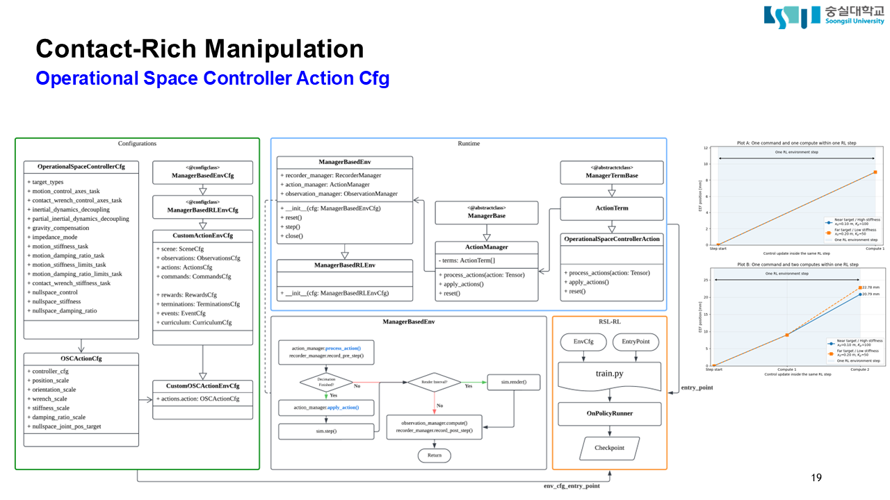

# Operational Space Control 구현 정리

이 문서는 IsaacLab 환경에서 UR5e를 Operational Space Control(OSC)로 제어한
방식을 정리한다.

전체 구현은 두 부분으로 나뉜다.

1. Isaac Lab의 OSC를 현재 환경에 맞게 사용하기 위해 직접 구현한 부분
2. Isaac Lab 내부에서 pose command를 joint torque로 변환하는 부분

직접 구현한 코드는 아래 파일을 참조.

- [`osc_sweep/mdp/actions.py`](../sweep_rl/sweep_rl/osc_sweep/mdp/actions.py)
- [`osc_sweep/env_cfg.py`](../sweep_rl/sweep_rl/osc_sweep/env_cfg.py)
- [`osc_sweep/assets.py`](../sweep_rl/sweep_rl/osc_sweep/assets.py)
- [`osc_sweep_independent/mdp/actions.py`](../sweep_rl/sweep_rl/osc_sweep_independent/mdp/actions.py)


## 전체 구조

```text
12-D action
    │
    │ 직접 구현한 action preprocessing
    ▼
[relative EEF pose(6), stiffness(6)]
    │
    │ Isaac Lab OperationalSpaceController
    ▼
UR5e 6축 joint torque
    │
    │ 직접 구현한 torque 검증 및 clamp
    ▼
UR5e arm actuator
```

OSC의 pose error 및 동역학 계산 자체를 새로 구현하지는 않았다. Isaac Lab의
`OperationalSpaceController`를 사용하고, 그 앞뒤의 action 변환과 torque 제한을
현재 환경에 맞게 구현했다.

## 구현 파트

### OSC 제어 frame 구성

OSC의 End-Effector(EEF)로 `SweepToolCenter`라는 가상 rigid body를 만들었다.
열린 gripper의 중심을 제어하기 위해 Robotiq base에서 `(0, 0, 0.16 m)` 떨어진
위치에 배치하고 fixed joint로 연결했다.

```text
Robotiq gripper base
        │
        │ fixed joint
        ▼
SweepToolCenter
        │
        └── OSC가 제어하는 EEF frame
```

`SweepToolCenter`는 collision이 없는 제어용 body다. Isaac Lab OSC 설정의
`body_name`에 이 body를 지정하여 pose, velocity와 Jacobian 계산의 기준으로
사용한다.

OSC가 torque를 출력할 관절은 UR5e의 다음 6개 arm joint로 지정했다.

```text
shoulder_pan_joint
shoulder_lift_joint
elbow_joint
wrist_1_joint
wrist_2_joint
wrist_3_joint
```

Gripper joint는 OSC action에 포함하지 않고 별도의 position target으로 제어한다.

### OSC 설정

Isaac Lab의 `OperationalSpaceControllerCfg`에서 현재 환경에 사용할 기능을 다음과
같이 선택했다.

```text
target_types = ["pose_rel"]
impedance_mode = "variable_kp"

motion_control_axes_task = (1, 1, 1, 1, 1, 1)
contact_wrench_control_axes_task = (0, 0, 0, 0, 0, 0)

motion_stiffness_limits_task = (20, 300)
motion_damping_ratio_task = (1, 1, 1, 1, 1, 1)
```

- `target_types`: OSC에 전달할 task-space target의 종류를 결정한다.
  `pose_rel`은 현재 EEF pose를 기준으로 3축 위치와 3축 회전의 상대 변화량을
  명령한다는 의미다.

- `impedance_mode`: Motion-control gain을 어떤 방식으로 결정할지 설정한다.
  `variable_kp`는 매 action에서 6축 stiffness를 새로 전달한다. Damping ratio는
  action으로 전달하지 않고 `motion_damping_ratio_task`의 값을 사용한다.

- `motion_control_axes_task`: Pose control을 적용할 task-space 축을 선택한다.
  순서는 `(x, y, z, rot_x, rot_y, rot_z)`이며, `1`은 해당 축의 motion control을
  활성화한다는 의미다. 현재는 translation과 rotation 6축을 모두 제어한다.

- `contact_wrench_control_axes_task`: 직접적인 force/torque control을 적용할 축을
  선택한다. 순서는 motion-control 축과 동일하며, `0`은 해당 축의 wrench
  control을 사용하지 않는다는 의미다. 현재는 모든 축이 비활성화되어 있으므로
  Wrist F/T 센서 값을 OSC feedback으로 직접 사용하지 않는다.

- `motion_stiffness_limits_task`: Action으로 전달되는 task-space stiffness의
  최솟값과 최댓값을 설정한다. 현재 각 축의 stiffness는 `[20,300]` 범위로
  제한된다.

- `motion_damping_ratio_task`: 각 task-space 축의 damping ratio
  $\boldsymbol{\zeta}$를 설정한다. 순서는 `(x, y, z, rot_x, rot_y, rot_z)`이며,
  현재 6축 모두 `1.0`을 사용한다. Damping gain은 stiffness와 이 값으로
  $\mathbf{K}_d=2\sqrt{\mathbf{K}_p}\boldsymbol{\zeta}$와 같이 계산된다.

### Custom 12-D action

Isaac Lab의 `OperationalSpaceControllerAction`을 상속하여
`SweepOperationalSpaceAction`을 구현했다.

Policy가 출력하는 action 순서는 다음과 같다.

$$
\mathbf{a}
= [k_x,k_y,k_z,k_{roll},k_{pitch},k_{yaw},
\Delta x,\Delta y,\Delta z,\Delta roll,\Delta pitch,\Delta yaw]
$$

앞의 6개 값은 EEF의 translation 3축과 rotation 3축 stiffness다. 뒤의 6개 값은
현재 EEF pose를 기준으로 한 상대 위치와 상대 자세다.

Isaac Lab OSC가 받는 내부 command 순서는 다음과 같다.

```text
[relative_position(3), relative_rotation_axis_angle(3), stiffness(6)]
```

따라서 custom action에서 policy action의 물리 단위를 변환하고, 회전 표현과
순서를 Isaac Lab 형식에 맞게 바꾼다.

### Action 전처리

입력 action은 먼저 `[-1,1]` 범위로 제한한다. NaN 또는 Inf 성분은 0으로
치환한다.

#### Stiffness 변환

Normalized stiffness action은 축별로 `[20,300]` 범위에 선형 mapping한다.

$$
K_i = 20 + \frac{a_i+1}{2}(300-20)
$$

| Normalized action | Stiffness |
| ---: | ---: |
| `-1` | `20` |
| `0` | `160` |
| `1` | `300` |

각 축의 diagonal stiffness를 독립적으로 결정한다. Full $6 \times 6$
stiffness matrix를 action으로 출력하지는 않는다.

#### Relative pose 변환

뒤의 6개 action은 다음 범위의 상대 pose로 변환한다.

$$
\Delta\mathbf{p}
= [\Delta x,\Delta y,\Delta z] \times 0.025\;m
$$

$$
\Delta\mathbf{r}_{rpy}
= [\Delta roll,\Delta pitch,\Delta yaw] \times 0.12\;rad
$$

한 action에서 명령할 수 있는 최대 변화량은 축별 위치 `±0.025 m`, 회전
`±0.12 rad`다.

Policy가 출력한 relative RPY는 quaternion으로 바꾼 뒤 axis-angle로 변환한다.
변환 결과와 stiffness를 Isaac Lab이 요구하는 순서로 재배열하여 controller에
전달한다.

### Torque 검증과 제한

Isaac Lab controller가 반환한 joint torque를 arm에 적용하기 전에 별도의
검증과 clamp를 추가했다.

Torque에 NaN 또는 Inf가 있으면 해당 environment의 6축 torque를 모두 0으로
만든다. 정상 torque는 각 joint effort limit의 `90%` 범위로 제한한다.

기본 UR5e 설정에서는 다음 범위를 사용한다.

| 관절 | Simulation effort limit | OSC clamp |
| --- | ---: | ---: |
| Shoulder, elbow 3축 | `150 N·m` | `±135 N·m` |
| Wrist 3축 | `28 N·m` | `±25.2 N·m` |

다음 상황은 `torque_saturated` 상태로 기록한다.

- Action에 NaN 또는 Inf가 들어온 경우
- Action이 `[-1,1]` 범위를 벗어난 경우
- OSC가 계산한 torque에 NaN 또는 Inf가 발생한 경우
- 계산된 torque가 joint effort limit에서 잘린 경우

검증이 끝난 torque는 다음 API로 arm joint에 직접 적용한다.

```python
robot.set_joint_effort_target(joint_torque)
```

Arm actuator의 내부 PD stiffness와 damping은 모두 `0`으로 설정했다. 따라서
별도의 joint position controller가 OSC torque와 동시에 arm을 제어하지 않는다.

### 제어 주기

현재 환경의 physics timestep은 `1/120 s`이고 action decimation은 `4`다.

```text
Action 갱신: 30 Hz
OSC torque 계산 및 적용: 120 Hz
```

Action을 받을 때 relative pose와 stiffness를 갱신한다. 그 사이의 physics
step에서는 같은 desired pose를 유지하면서 현재 로봇 상태로 torque를 다시
계산한다.

### 환경별 확장

기본 Sweep 환경은 `SweepOperationalSpaceAction`을 사용한다.

Constant Velocity 계열에는 `OpenGripperSweepOperationalSpaceAction`을 추가했다.
Arm OSC는 동일하며, 모든 physics step에서 gripper open target `0.0`을 다시
적용한다.

Independent 계열에는 `IndependentSweepOscAction`을 구현했다. Reset마다 다음
calibration multiplier를 sampling한다.

| 항목 | 범위 |
| --- | ---: |
| Stiffness calibration | `0.95–1.05` |
| Damping calibration | `0.95–1.05` |
| Effort-limit calibration | `0.97–1.03` |

Stiffness calibration은 action으로 계산한 gain에 곱한 뒤 `[20,300]` 범위로 다시
제한한다. Damping calibration은 Isaac Lab이 계산한 damping gain에 곱한다.
Effort-limit calibration은 torque clamp 범위를 변화시킨다.

Independent 계열도 모든 physics step에서 gripper open target `0.0`을 유지한다.

## Isaac Lab 내부 OSC 구조


