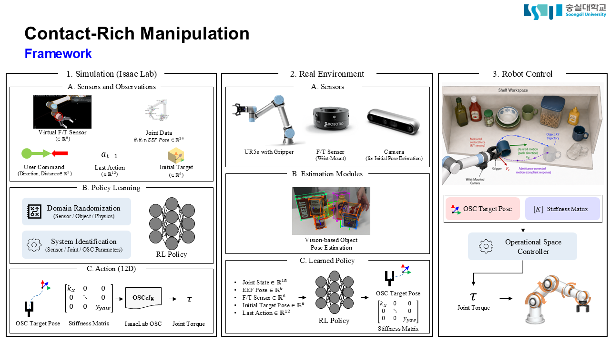

# Task-Definition

## 1. Force-Feedback Control

현재 주제는 **“일정한 힘으로 물체를 미는 정책”**이 아니다.

> **물체의 위치와 물성을 직접 알지 못하는 상태에서, F/T 및 접촉 정보를 이용하여 물체를 적절한 방향과 속도로 밀고, 접촉 변화에 따라 행동을 조정하는 적응형 Sweep Manipulation 정책**

- 물체를 **어디에서 어떤 방향으로 밀 것인가**
- 물체를 **어느 정도의 속도로 밀 것인가**
- 접촉력이나 주변 접촉이 변할 때 **속도와 움직임을 어떻게 적응시킬 것인가**

### 1-1. “목표 힘”을 User Command에서 제거

기존 구성은 아래와 같다.

- 미는 방향
- 미는 거리
- 목표 힘

여기서 **목표 힘을 제거** 필요.

물체의 무게와 형상을 모르는 상태에서는 사전에 “몇 N으로 밀어라”라고 지정할 수 없다. 또한 일정한 힘을 유지하는 것이 항상 최적 행동이라고 볼 수도 없다. 접촉 상태가 바뀌거나 장애물과 추가로 접촉하면 정책이 힘과 속도를 변경해야 하기 때문이다.

### 1-2. 단일 Pushing은 1단계 검증

전체 작업은 다음과 같다.

1. 특정 물체를 밀어 공간을 확보한다.
2. 로봇이 확보된 공간으로 진입한다.
3. 이후 목표 물체에 접근하거나 grasping을 수행한다.
4. 이 과정에서 그리퍼뿐 아니라 로봇의 다른 부분에도 접촉이 발생할 수 있다.

따라서 Sweep Manipulation 정책은 단순히 목표 물체를 지정 위치까지 미는 것에서 끝나는 것이 아니라, **후속 manipulation을 가능하게 하는 공간 확보 동작**으로 연결되어야 한다.

**현재 단계에서는 단일 타깃 밀기를 먼저 학습하되, 최종 시스템 설계에는 이동 중 발생하는 주변 물체와의 접촉까지 포함해야 한다.** 

---

# Control
## 2. Operational Space Control

### 2-1. OSC action의 두 요소가 서로 중복될 가능성

현재 제안한 action은 대략 다음 두 요소로 구성되어 있었다.

- OSC target pose 또는 target pose increment
- Stiffness matrix

다만, 이러한 구성에서 OSC가 더 큰 운동을 만드는 방법은 두 가지가 있다.

- 현재 pose에서 더 멀리 떨어진 target pose를 지정한다.
- 동일한 target pose에 대해 stiffness를 크게 설정한다.

두 방법 모두 결과적으로 더 큰 wrench, joint torque 또는 빠른 운동을 만들 수 있다. 따라서 target displacement와 stiffness를 모두 자유롭게 출력하게 하면 **action redundancy**가 발생할 수 있다.

이 경우 정책은 동일하거나 유사한 움직임을 여러 action 조합으로 생성할 수 있으므로 학습 문제가 불필요하게 ill-posed해질 수 있다. 다음을 확인해야 한다.

- [ ] Target pose displacement의 허용 범위
- [ ] Stiffness의 허용 범위
- [ ] 두 action 사이에 기존 OSC 구현이 적용하는 constraint가 있는지
- [ ] 두 action의 역할을 분리할 수 있는 parameterization 또는 normalization이 있는지

---

## 2-2. Stiffness를 정책이 임의로 결정하게 해서는 안 됨

로봇은 현재 configuration에 따라 특정 방향으로는 쉽게 움직일 수 있고, 다른 방향으로는 움직이기 어렵다. 따라서 동일한 Cartesian stiffness를 모든 방향에 적용하거나, 정책이 이러한 구조를 모른 채 stiffness를 학습하게 하는 것은 비효율적일 수 있음.

교수님이 제안한 방향은 다음과 같다.

1. Jacobian을 linear와 angular 부분으로 분리한다.
   - \($J_v$\): translational motion
   - \($J_\omega$\): rotational motion
1. 각각에 대해 manipulability measure 또는 manipulability ellipsoid를 계산한다.
2. SVD 등을 이용하여 방향별 manipulability를 구한다.
3. 해당 값을 기준으로 stiffness를 scaling하거나 constraint한다.

즉, stiffness는 단순한 자유 action이 아니라, **현재 로봇 자세에서의 방향별 조작성과 연결된 구조화된 action**이어야 한다.

---

# ETC

- [x] 교수님은 “joint-based data”, “contact sensor”처럼 포괄적으로 표기하지 말고, 각 Observation의 물리량과 차원을 정확하게 작성할 것
- [x] Isaac Lab의 Contact Sensor 삭제
- [x] Particle-filter 기반 Contact Point Estimation 삭제
- [ ] Joint torque로부터 외력을 단순 역산하지 말 것
- [ ] 실제 F/T 센서의 분해능을 중요하게 볼 것

## TODO (ASAP)

- [ ] OSC의 Target Pose와 Stiffness의 Constraint 체크
- [ ] OSC의 Manipulability 체크
- [ ] F/T 센서의 리스트 업과 사양 체크
- [ ] Tensorboard를 포함한 진행 상황 Upload

